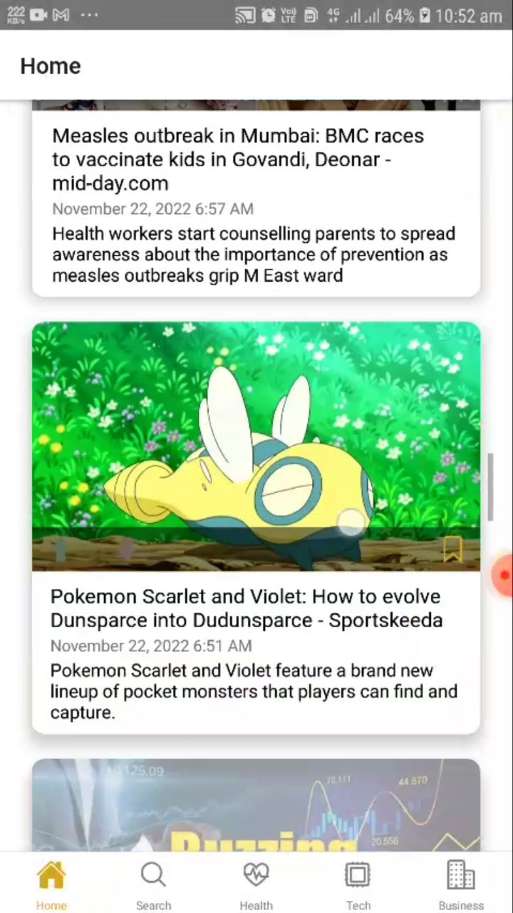
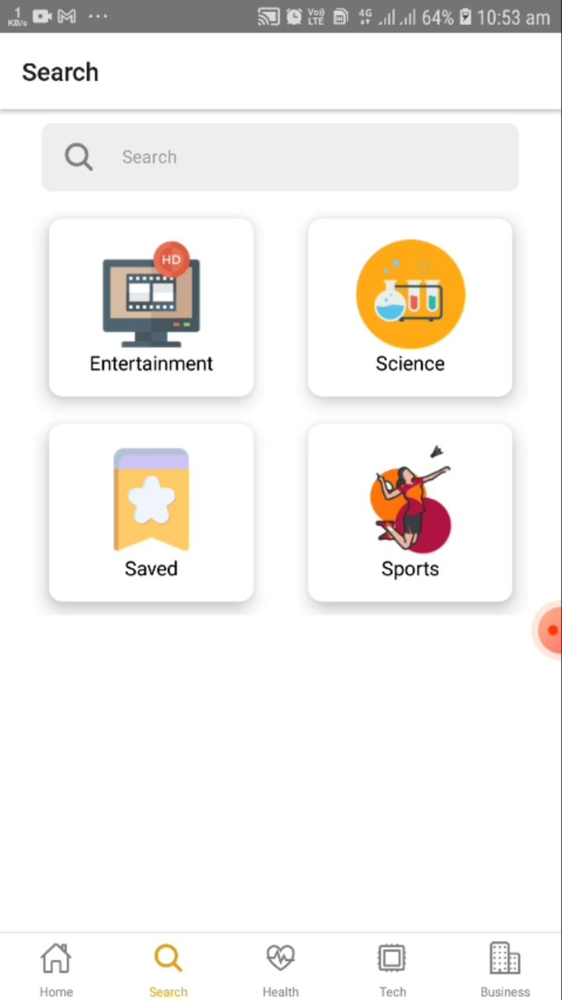
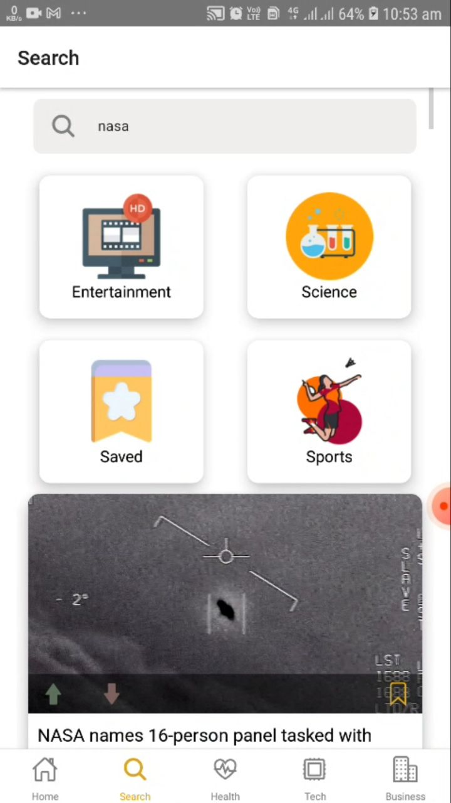
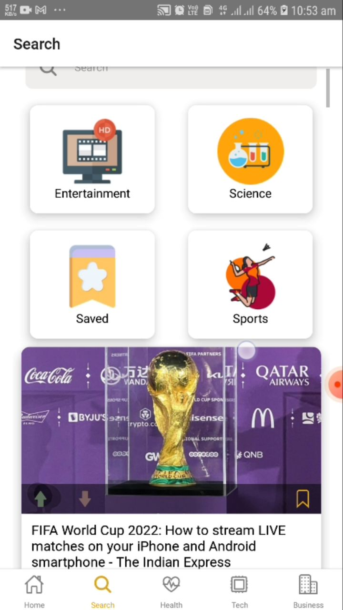

# News App

A news app to show and search news of different categories.
Made with [React Native](https://reactnative.dev/), [Typescript](https://www.typescriptlang.org/) and [News Api](https://newsapi.org/).

[](https://giphy.com/gifs/demo-mobile-app-react-native-rmLFc0t1T2Vnfr1A1Z)


## :star: Features

- Bare React Native
- React Native Typescript Template
- Tab Navigation installed
- Tab Screens
- See treding news categories
- Search news by categories and topic
- Search news by input term

## ⚒️ Tech stack

- [React Native](https://reactnative.dev/)
- [Typescript](https://www.typescriptlang.org/)
  - [help](https://react-typescript-cheatsheet.netlify.app/)
- [News Api](https://newsapi.org/)

## :star: Get Started

### React Native Setup

make sure to have setup development environment

[📍 Setting up the development environment](https://reactnative.dev/docs/environment-setup)

```bash
# clone
git clone https://github.com/sketchomania/news-app.git
```

```bash
# install dependencies
npm install

# Or use `yarn`
yarn install
```

Run project

```bash
# run project
npx react-native run-android
```

### Screenshot

<div style="display: flex; margin: 1rem; justify-content: space-around; flex-wrap: wrap">
 
 
 
</div>
<div style="display: flex; margin: 1rem; justify-content: space-around; flex-wrap: wrap">
 
 
 
</div>

## 🚀 Contribute

Contributions are most welcome in this project be it reporting an issue or sending a pull request.

Some of the things you could help with currently are -

1. Improvements
   - Make ["searchByCategory"](src/screens/search/SearchScreen.tsx) of searchScreen global and use it in every screen.
2. Adding features
   - You can add useThemes()
   - Splash Screen can added
   - Dark mode can be added
